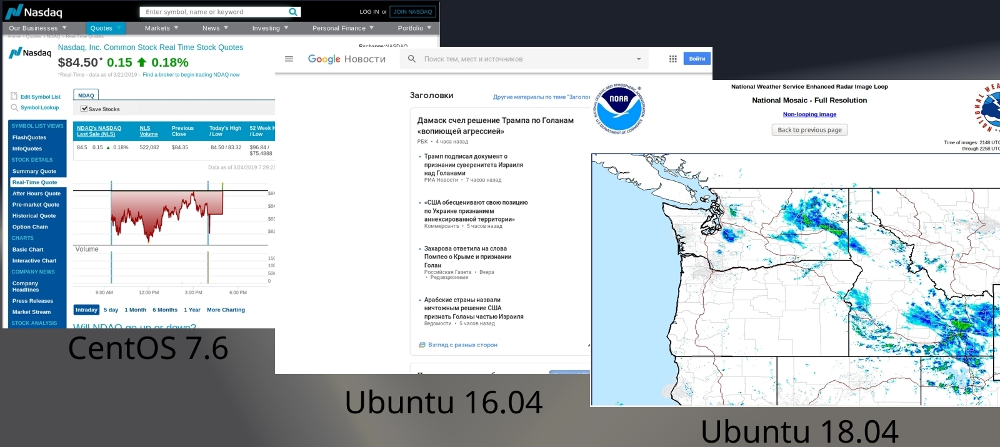

# KioskMode
Quickly turn a CentOS or Ubuntu machine into a kiosk.

With this utility, you can convert a default desktop Linux install into an internet kiosk. Useful for displaying graphs,
weather charts, stock ticker, etc. It will optionally install xdotool which fakes a user keypress of F11 to allow Firefox 
to become full screen.

Tested on full installations of CentOS 7.6, and Ubuntu 16.04 (Gnome) and Ubuntu 18.04. 

Requires sudo access.

To run:
$ sudo ./kioskmode.sh
